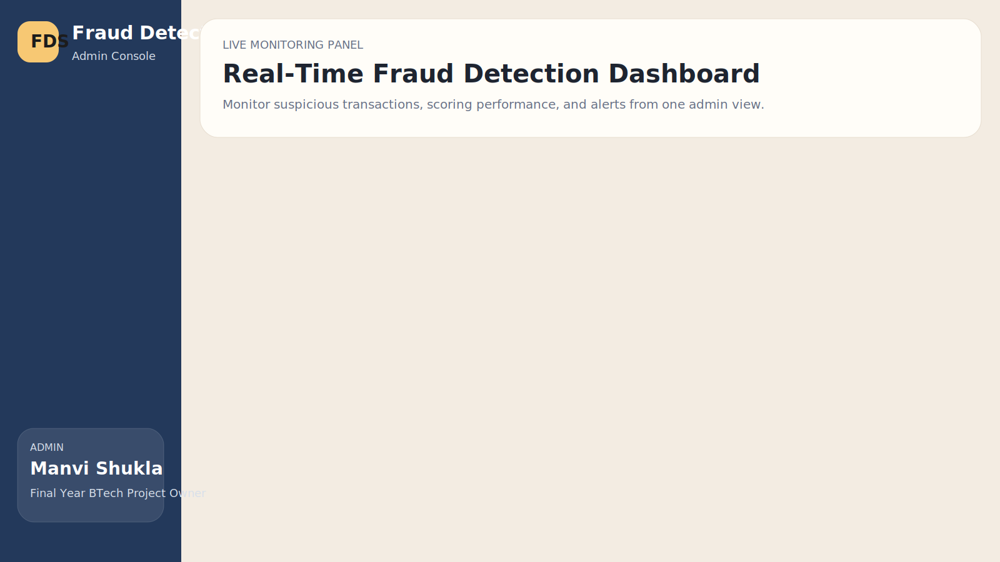
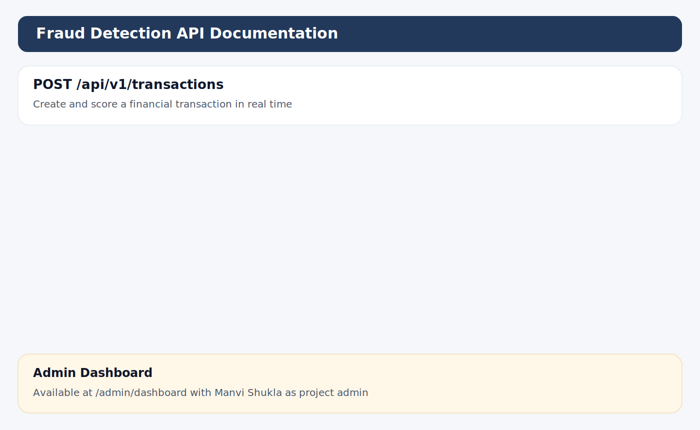

# Fraud Detection Project Documentation

This repository-style documentation module presents the Fraud Detection System as a polished final-year BTech project. It includes the academic, technical, and deployment material needed to explain the system clearly during submission, viva, or portfolio review.

## Recommended Usage

- Start with `report/project_report.md` for the full academic narrative
- Review `api/api_contract.md` for endpoint details
- Use `testing/test_plan.md` during implementation review
- Use `presentation/presentation_outline.md` to prepare for viva or seminar

## Preview Assets

### Dashboard

### API Docs

